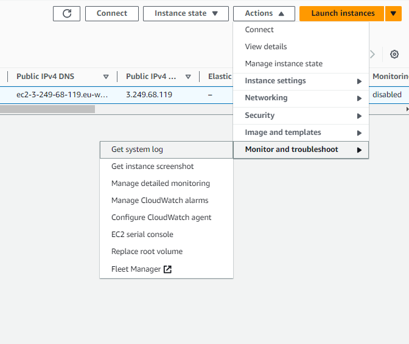

# Hosting WordPress on an EC2 Instance
- [Hosting WordPress on an EC2 Instance](#hosting-wordpress-on-an-ec2-instance)
    - [Introduction](#introduction)
    - [Prerequisites](#prerequisites)
    - [What is EC2?](#what-is-ec2)
    - [Step 1: Login to your AWS Account](#step-1-login-to-your-aws-account)
    - [Step 2: Create your AWS VPC](#step-2-create-your-aws-vpc)
    - [Edit VPC Settings:](#edit-vpc-settings)
    - [Step 3: Add Internet Gateway to your VPC](#step-3-add-internet-gateway-to-your-vpc)
    - [Step 4: Creating Subnet in your VPC](#step-4-creating-subnet-in-your-vpc)
    - [Step 5: Creating and Associating Route Tables to your Subnet](#step-5-creating-and-associating-route-tables-to-your-subnet)
    - [Step 6: Creating a Security Group for your WordPress EC2 Instance](#step-6-creating-a-security-group-for-your-wordpress-ec2-instance)
    - [Step 7: Launch EC2 Instance Hosting WordPress Application](#step-7-launch-ec2-instance-hosting-wordpress-application)
    - [Step 8: Access WordPress Webpage \& Retrieve WordPress Credentials](#step-8-access-wordpress-webpage--retrieve-wordpress-credentials)
    - [Step 9: Retrieve WordPress Credentials](#step-9-retrieve-wordpress-credentials)
    - [Step 10: Login to your WordPress Application](#step-10-login-to-your-wordpress-application)
    - [Clean up](#clean-up)

### Introduction
Hosting WordPress on AWS EC2 allows you to leverage the scalability, reliability, and security of Amazon Web Services. This guide will go through the key AWS concepts such as EC2, VPC, subnet, route table, and security group, and how they all interlink to create a secure and scalable environment for your application.

### Prerequisites
- AWS Account
- Basic understanding of networking concepts
- Familiarity with the AWS Management Console

### What is EC2?
Amazon Elastic Compute Cloud (EC2) is a web service provided by Amazon Web Services (AWS) that allows users to rent virtual servers (referred to as "instances") on which they can run their applications. EC2 instances are essentially virtual machines that can be launched in the cloud and scaled up or down as needed.

 

**Why do we need an EC2 instance?**

One of the main reasons we need EC2 instances is because they offer **scalability and flexibility**. We can launch EC2 instances **on demand and scale up or down** as needed to match our workload requirements. This means we can easily provision resources when we need them and only pay for what we use.

### Step 1: Login to your AWS Account
Sign in to your AWS account as an IAM user using your account ID or alias, and the IAM username and password you created for your specific user.

### Step 2: Create your AWS VPC

1. Navigate to the search bar on the AWS console home page and type `VPC`.
2. Once on the VPC dashboard, click **Create VPC**.
3. Configure the VPC settings:
   - **Resources to Create**: VPC only 
   - **Name tag**: `WordPress-VPC`
   - **IPv4 CIDR block**: 10.0.0.0/16
   - **IPv6 CIDR block**: No IPv6 CIDR block
   - **Tenancy**: Default
- Click **Create VPC**.

### Edit VPC Settings:
- Navigate to the Actions dropdown in the top right and select **Edit VPC Settings**.
- Check the boxes under DNS settings.
- Click **Save**.

 ### Step 3: Add Internet Gateway to your VPC
 -  Navigate to the left pane of the VPC dashboard and click on **Internet Gateways**.
 -   Click on **Create internet gateway**.
 -   Configure the Internet Gateway settings:
   - **Name tag**: `WordPress-Ig`
 -  Click **Create Internet Gateway**.
 -   Navigate to the Actions dropdown list and select **Attach to VPC**.
 -    Select your VPC (`WordPress-VPC`) and click **Attach Internet Gateway**.
  
  

### Step 4: Creating Subnet in your VPC

1. Navigate to the left pane of the VPC dashboard and click on **Subnets**.
2. Click on **Create subnet**.
3. Select your VPC (`WordPress-VPC`) from the dropdown list.
4. Configure the Subnet settings:
   - **Subnet name**: `WordPress-subnet-01`
   - **Availability Zone**: Choose one from your region
   - **IPv4 CIDR block**: 10.0.1.0/24
5. Click **Create Subnet**.

> [!NOTE]
> Amazon VPC (Virtual Private Cloud) lets you provision a logically isolated section of the AWS Cloud where you can launch AWS resources in a virtual network.

### Step 5: Creating and Associating Route Tables to your Subnet

1. Navigate to the left pane of the VPC dashboard and click on **Route Tables**. - *to associate the public route table to the public subnet and add a route to the internet through the internet gateway.*
2. Click on **Create route table**.
3. Configure the Route Table settings:
   - **Name**: `WordPress-public-rt`
   - **VPC**: `WordPress-VPC`
> [!NOTE]
> A route table contains a set of rules, called routes, that are used to determine where network traffic is directed.
  
1. On the route table details page, click on **Subnet Associations**.
2. Click **Edit Subnet Associations**.
3. Select your subnet (`WordPress-subnet-01`) and click **Save Associations**.
   
> [!NOTE]
> A subnet is a range of IP addresses in your VPC. You can launch AWS resources into a specified subnet.

1. Click on **Routes**, then **Edit Routes**.
2. Click **Add Route**.
3.  Configure the Route settings:
    - **Destination**: 0.0.0.0/0
    - **Target**: Select your Internet Gateway (`WordPress-Ig`)
4.  Click **Save Changes**.
    

### Step 6: Creating a Security Group for your WordPress EC2 Instance

1. Navigate to the left pane under the Virtual private cloud dropdown and click on **Security Groups**.
2. Click on **Create security group**.
3. Configure the Security Group settings:
   - **Security group name**: `WordPress-SG`
   - **Description**: Security group for our EC2 instance hosting our WordPress application
   - **VPC**: `WordPress-VPC`
4. Click **Add Rule** to add inbound rules:
   - **HTTP**: Port 80, Source 0.0.0.0/0
   - **HTTPS**: Port 443, Source 0.0.0.0/0
   - **SSH**: Port 22, Source 0.0.0.0/0
> [!NOTE]
> To ensure your WordPress site is accessible and secure, we need to configure the security group with specific inbound rules for HTTP, HTTPS, and SSH traffic.
### Step 7: Launch EC2 Instance Hosting WordPress Application

1. Navigate to the search bar on the AWS console home page and type `EC2`.
2. Click on **EC2 - Virtual Servers in the Cloud**.
3. Once on the EC2 dashboard, click **Launch instance**.
4. Configure the instance settings:
   - **Name**: `WordPress-EC2-Instance-01`
   - **AMI**: WordPress Certified by Bitnami and Automatic (Free Tier Eligible). **Click subscribe on instance launch**
   - **Instance Type**: t2.micro
   - **Key Pair**: Create a new key pair
   - **Network Settings**: 
     - **VPC**: `WordPress-VPC`
     - **Subnet**: `WordPress-subnet-01`
     - **Auto-assign public IP**: Enable
     - **Security Group**: Select `WordPress-SG`
5. Click **Launch instance**.

### Step 8: Access WordPress Webpage & Retrieve WordPress Credentials

1. Navigate to the EC2 dashboard and click on **Instances**.
2. Select your WordPress instance (`WordPress-EC2-Instance-01`) and copy the public IPv4 address. 

### Step 9: Retrieve WordPress Credentials
Paste the IP address in your web browser with `/wp-admin` at the end to access the WordPress login page.

- To retrieve your WordPress credentials, go back to the EC2 dashboard:
- Select your instance, click on **Actions** > **Monitor and Troubleshoot** > **Get System Log**.

  

- Scroll through the system log to find the Bitnami application credentials.
  

### Step 10: Login to your WordPress Application

1. Go back to the WordPress login page.
2. Enter the default username (`user`) and the password retrieved from the system log.
3. Click **Log In**.

### Clean up

To avoid unnecessary charges, terminate the EC2 instance and delete the VPC by ensuring all associated resources (subnets, internet gateway, route tables, security groups) are removed. 

